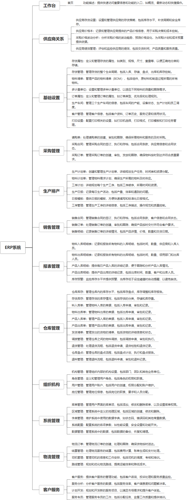

 

    
 

公司拥有上百套具有自主知识产权的软件系统，详情请查看码云首页或公司官网

 
<h1>ERP</h1>

<a href="https://www.haishi.net.cn/">公司官网</a> ｜ <a href="https://www.haishi.net.cn/">在线体验</a>

 

## 系统介绍

工厂全流程管理，包含生产、库存、供应商、工作流、办公、客户等功能。
工厂全流程管理，包含生产、库存、供应商、工作流、办公、客户等功能。
本项目名称为企业ERP管理系统，是一款面向企业内部使用的管理系统，旨在帮助企业实现对采购、销售、生产、仓库、物流等环节的全面管理。
本系统主要模块包括：供应商关系管理、采购管理、销售管理、生产排产、仓库管理、报表管理、组织机构管理、物流管理等。
本系统从用户层面可以分为一个端：
- 管理端：公司内部管理员用户使用，可以进行基础数据维护、供应商管理、采购管理、销售管理、生产管理、仓库管理、物流管理等。
                

## 系统功能介绍

### 系统包含终端说明

管理端（WEB）

| 序号 | 模块 | 模块说明 |
| --- | --- | --- |
| 1 | GC-ERP-SAAS-SERVER | 服务端 |
| 2 | GC-ERP-SAAS-MANAGE | 管理端 |

### 系统功能结构

### 系统功能说明

- 供应商关系管理：涵盖供应商存货设置、价格管理、绩效管理等功能，帮助企业建立良好的供应商合作关系。
- 采购管理：包括请购、合同、订单等全流程管理，实现对采购业务的精细化管理。
- 销售管理：涵盖合同、订单、明细等管理功能，帮助企业跟踪销售全过程，提高销售效率。
- 生产排产：包括计划制定、物料需求分析、工序管理等功能，实现对生产过程的合理安排和控制。
- 仓库管理：提供库存管理、出入库管理、盘点等功能，实现对仓库物资的精细化管理。

## 系统主要界面

## 系统技术说明

### 代码模块说明

| 序号 | 目录 | 目录说明 |
| --- | --- | --- |
| 1 | GC-ERP-SAAS-SERVER/px-platform | -- |
| 2 | GC-ERP-SAAS-SERVER/px-module | -- |
| 3 | GC-ERP-SAAS-SERVER/px-web | -- |
| 4 | GC-ERP-SAAS-SERVER/px-plugins | -- |
| 5 | GC-ERP-SAAS-SERVER/.idea | -- |

### 系统技术选型

#### 开发语言/框架

JAVA（JDK1.8）
前端框架：VUE2
脚手架：JEEPLUS
系统结构：单体应用
框架：SpringBoot2.x

#### 服务中间件

Nginx
Tomcat

#### 数据库

MySQL（5.7+）

#### 其他说明

无

## 系统演示/商用

请扫码添加客服微信获取演示地址和系统详细资料。

如果您想基于ERP进行商业化交付或定制开发服务，我们提供有偿的技术服务支持，合作模式不限，欢迎沟通！

公司官网地址： <a href="https://www.haishi.net.cn/">https://www.haishi.net.cn</a>

联系客服获取专业回答。

## 使用须知

1、 本项目商用必须获得版权所有者的授权。

2、 未经允许本项目代码不允许二次出售。

